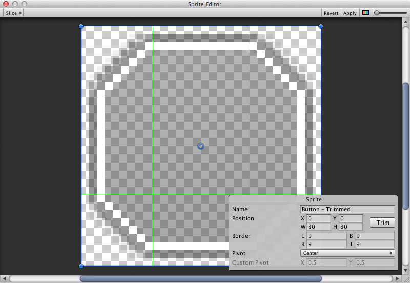

# 주요 UI 컴포넌트 (RectTransform, Image, Text, Button)

UI 요소를 배치하기 위해서 주요 UI 컴포넌트에 대해서 알아보자.

## RectTransform

RectTransform 기능은 UI 요소의 위치, 회전, 크기 조절을 할 수 있고 너비와 높이 조정도 가능하다.

* Pos는 UI 요소의 위치를 정할 수 있다. Pos X 축을 움직이면 왼쪽으로 이동하게 되고, Pos Y 축을 움직이면 위쪽으로 이동하는 것을 볼 수 있다.
* Anchors는 특정 영역에 UI 요소를 고정시킬 수 있다. 그러하여 해상도가 변경되었을때도 사용자의 의도를 충족시킬 수 있다. 아래 이미지의 앵커 좌표를 원점으로 하여 UI 요소 위치 기준값을 결정할 수 있다. 

* 왼쪽 상단 모서리에 있는 Anchor Preset 버튼에 대해서 알아보자면, UI 요소의 앵커를 쉽게 설정할 수 있도록 유니티가 제공해주는 것이다.

* UI 요소를 앵커에 대한 원점으로 변경 하고 싶다면 Window 기준으로 Ctrl + alt + Shift + 앵커 좌 클릭을 하면 된다.

* Pivot는 현재 오브젝트의 원점에 대한 기준이다.

## Image

* 이미지를 불러올 때는 Source Image의 맨 오른쪽의 동그란 모양의 아이콘을 클릭하여 가져올 수 있다.
* Color에서는 색상을 설정할 수 있다.
* Material은 UI 요소 재질 설정을 할 수 있다.

* Image Type이란 스프라이트가 어떻게 표현될지의 방식을 말한다.
* Simple은 전체 스프라이트를 같은 크기로 조정할 수 있다
* Sliced는 9 슬라이스 방식을 활용하여 크기를 조정하여도 특정 부분만 늘어나도록 할 수 있다. 그렇게 하기 위해선 Sprite Editor라는 기능을 사용해야 한다.
* Tiled은 위의 방식과 비슷한 방식이지만 이미지 중앙이 늘어나는 것이 아닌 반복된다. 테두리가 없는 스프라이트는 전체 이미지가 반복이 되는 걸 볼 수 있다.
* Filled - 정해진 방향과 방법, 양으로 원점에서 스프라이트를 채운다는 방식을 빼면 Simple과 같은 방식이라고 볼 수 있다.

### Sprite Editor

* 편집하고자 하는 UI 리소스를 선택 후 Inspector에 버튼을 클릭한다.
* 스프라이트 편집기를 통해 이미지를 9 슬라이스 하는 옵션에 대해서도 알아보자면, 이는 이미지를 9개 영역으로 나누어 스프라이트 크기가 변화되어도 모서리 부분이 늘어나지 않는다.

## Text

* 텍스트를 표시하기 위해서는 텍스트 영역을 먼저 설정해야한다.
* 텍스트의 폰트, 폰트 스타일, 폰트의 크기 등을 설정할 수 있다.
* Paragraph의 Horizontal Overflow, Vertical Overflow에서 Wrap을 설정하면 지정한 영역 내에서 텍스트가 작성된다. Overflow로 설정했을 경우엔 지정한 영역 밖으로 텍스트가 벗어난다.

* Best Fit을 설정하면 텍스트가 영역의 너비 또는 높이보다 사이즈가 클 때 제어를 할 수 있다. 사용 가능한 공간에 맞춰 텍스트 크기를 조정할 수 있다. Min Size와 Max Size는 Font Size와 동일하게 지정하는 것이 좋다.

## Button

* 버튼은 사용자가 이를 클릭했을때 응답하고 시작, 작업을 확인할 때 사용된다.
* 게임 플레이 시작, 저장, 취소 등의 작업을 수행할 수 있도록 만들어 주는 기능이다.

# 피드백

* Pivot은 현재 오브젝트의 원점에 대한 기준입니다. 앵커랑 비슷한데 앵커랑은 또 독립적입니다. UI 요소에 대해 앵커 설정시 피벗도 같이 변하는걸 확인 할 수 있습니다.

* 'Pos는 아래 설명의 Anchor와 Pivot의 기준으로 설정된 실제 좌표이다. 이를 사용하여 UI 요소의 크기를 변경할 수 있다.' 해당 설명이 잘못된 것 같습니다. 다시 한번 메뉴얼을 살펴보고 수정 부탁드립니다.

* 'UI 요소의 원점을 두고 싶을 경우엔 캔버스의 왼쪽 하단(0,0) 오른쪽 상단(1,1)일 때 Anchor의 값을 (0.5, 0.5)로 지정하면 된다.' `원점을 두고 싶을 경우엔 -> 정중앙에 위치 시키고 싶을 경우엔` 제가 이해한게 맞는지 확인 바라고, 맞다면 수정 부탁드립니다.

* Anchor와 AnchorPreset에 대한 설명이 묘하게 이상합니다. 앵커에 대해서는 이해를 한 것 같으나 앵커 프리셋에서 'UI 요소를 부모 영역의 측면이나 중간에 고정을 시켜 부모 크기와 함께 늘릴 수 있다. 여기에서 수평 및 수직은 독립적이다.' 여기서 `부모 크기와 함께 늘릴 수 있다.` 와 `수평 및 수직은 독립적이다.` 라는 말에 대해 이해를 못하겠습니다. 추가 설명 혹은 수정 부탁드립니다.

* '이미지에는 Rect Transform 구성 요소와 Image 구성 요소가 있다. 유니티에서 이미지를 스프라이트라고 불리우는데, 스프라이트는 대상 그래픽 필드 하단의 이미지 구성 요소에 적용할 수 있다.' `RectTransform 구성요소? 대상 그래픽 필드 하단?`

* 이후 피드백은 만나서 진행하겠습니다.

# 피드백
`부모 크기와 함께 늘릴 수 있다.` 와 `수평 및 수직은 독립적이다.` 라는 말에 대해 이해를 못하겠습니다. 추가 설명 혹은 수정 부탁드립니다. 

-> 유니티 설명서 보고 쓴 건데 저도 잘 쓰면서 이해가 잘 가지않습니다..유니티 설명서에 'UI 요소를 부모의 측면이나 가운데에 고정하거나 부모 크기와 함께 늘릴 수 있습니다. 수평 및 수직 앵커링은 독립적입니다.' 이렇게 작성되어 있는데 설명이 이해가 잘 안 됩니다.