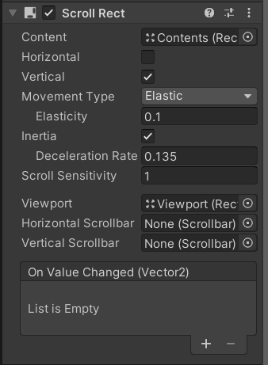
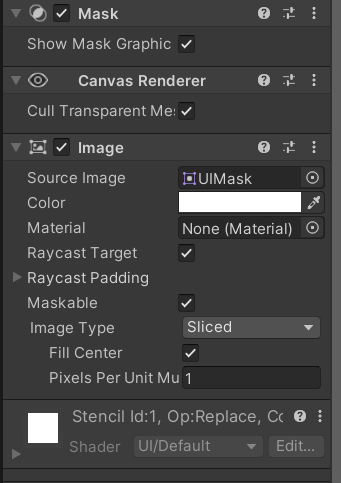
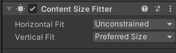
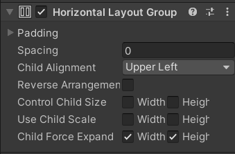

# 주요 UI 컴포넌트 2 (CanvasGroup, ScrollRect, LayoutGroup)

UI 요소를 배치하기 위해서 주요 UI 컴포넌트에 대해서 알아보자.

## CanvasGroup
캔버스 그룹 하위에 있는 모든 UI 요소를 한 번에 조정할 수 있다. 

* Alpha는 불투명도를 조정할 수 있다.
* Ignore Parent Groups는 상위 캔버스 그룹에 영향을 받고싶지 않을 때 사용한다.

## ScrollRect
많은 영역을 필요로 하는 Contents를 작은 영역에 표시해야 할 때 UI를 스크롤하는 기능을 제공한다.

* GameObject - UI - Scroll View 이 순서를 따르면 유니티의 사전 설정 된 스크롤뷰를 만들 수 있다.

* Scroll View는 ScrollRect - Viewport - Contents의 순서로 구성된다.

### 속성

* Content는 스크롤하는 내용이 있는 오브젝트이다.
* Horizontal과 Vertical는 스크롤의 방향을 설정할 수 있다. 

* Viewport는 Content가 보여지는 영역이다. 해당 영역을 구성하기 위해 Mask와 Image가 있어야 한다.

## Auto Layout

### Content Size Fitter
UI 요소의 크기를 자동으로 조절해준다. 방법으로는 3가지가 있고 Unconstrained(제약 없음), Min Size(최소 크기), Preferred Size(적절한 크기)가 있다.

### Horizontal/Vertical Group

하위 UI 요소들을 가로/세로 방향으로 일정하게 배치된다.

* Padding은 하위 UI 요소들의 여백을 설정한다.
* Spacing은 UI 요소들의 간격을 설정한다.
* Child Alignment은 UI 요소들의 정렬 형태를 설정한다.
