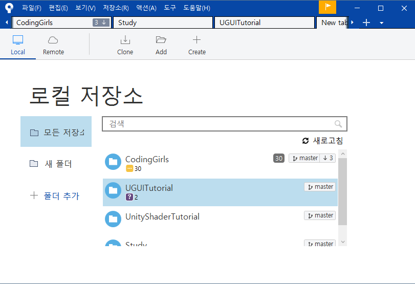
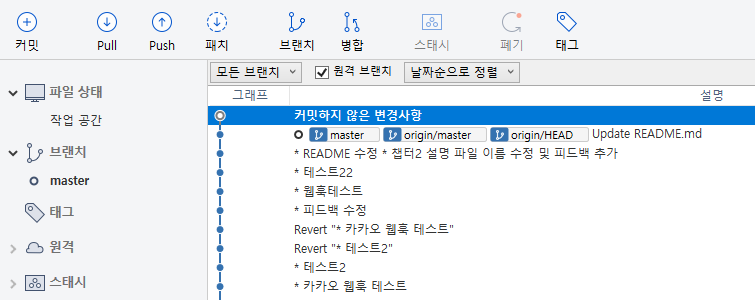
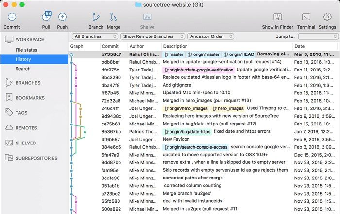
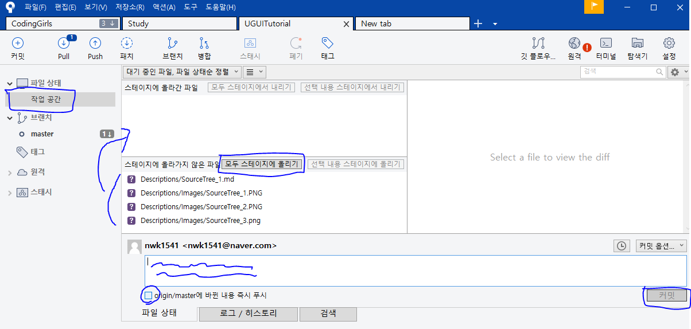

# 소스트리

버전 관리 툴(소프트웨어)이자 협업 툴인 Git을 커맨드라인이 아닌 UI로서 사용하기 편하게 만든 소프트웨어

## 사전 용어 정리

* 저장소(Repository) : Git으로 관리되는 프로젝트 폴더를 의미
* 로컬(Local) 과 원격(Remote) : 로컬은 현재 내 컴퓨에 존재하는 프로젝트 폴더, 원격은 넷상 어딘가에서(Github, Gitlab 등) 관리되는 원본 프로젝트 폴더, 로컬에서 원격 저장소의 원본을 내려받아서 최신화하고, 작업한 내용을 커밋하여 원격 저장소에 변경본을 합친다.
* 클론(Clone) : 원격 저장소를 로컬에 내려받는것을 의미 

## 기능 설명

[Git GUI 소스트리 설치방법과 사용방법](https://uxgjs.tistory.com/181)

|  |
|:--:|
| *소스트리 초기화면(Windows)* |

* 상단에 등록된 저장소 탭을 통해 각 프로젝트의 작업목록에 접근할 수 있으며 `+` 버튼을 눌러서 새로운 탭에 현재 내려받은(클론) 저장소 외에 새로운 저장소를 등록할 수 있다.
* `Clone` 버튼을 눌러서 원격 저장소 주소(Ex : git@github.com:nwk1541/UGUITutorial.git)와 내 컴퓨너에 내려받을 경로를 설정하면 저장소를 다운 받을 수 있다.

|  |
|:--:|
|  |
| *저장소 Clone 후 화면(위 Windows, 아래 Mac)* |

* 커밋(Commit) : 현재 내 컴퓨터에서 작업한 변경사항에 대해 저장한다.(스냅샷을 찍는다)
* 풀(Pull) : 원격 저장소에 있는 모든 내용을 다운받는다.
* 푸시(Push) : 로컬 저장소에 커밋할 내용을 원격 저장소에 업로드 한다.
* 패치(Fetch) : 원격 저장소의 내용에 대해 새로고침 한다.

## 일반적인 일련의 작업과정

-----

새로운 저장소를 로컬에 다운받을 경우

1. 소스트리 첫 화면에서 `Clone`을 누르고 Git 주소와 다운받을 경로를 설정한다.
2. 클론이 성공했다면 해당 프로젝트의 히스토리를 확인하여 제대로 받았는지 확인한다.

-----

내가 작업한 변경사항을 원격 저장소에 업로드 할 경우

1. 내 컴퓨터의 작업 공간(워크 스페이스) 탭을 클릭하여 내가 작업한 혹은 변경한 내용을 확인한다.
2. 특정 작업 내용을 선별해서 클릭하여 `스테이지(Stage)`에 올리거나 모든 작업 내용을 스테이지에 올린다.
3. 작업 내용에 대해 요약하여 커밋 메시지를 작성하고 커밋 버튼을 누른다.
4. 히스토리를 확인하여 제대로 커밋이 됐는지 확인한다.

* 커밋할 때 소스트리의 옵션으로 있는 체크박스를 활성화해서 바로 원격 저장소에 푸시가 가능하다.
* 충돌(로컬에서 작업한 변경내용이 다른 작업자와 같은 부분을 변경했을 경우)이 발생할 수 있기 때문에 커밋 전에 풀이나 패치를 통해 원격 저장소의 내용을 업데이트 해두는 것이 좋다.