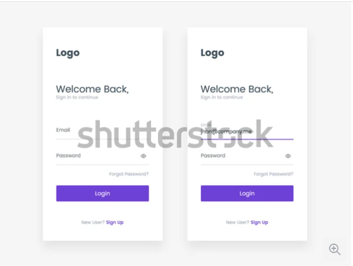
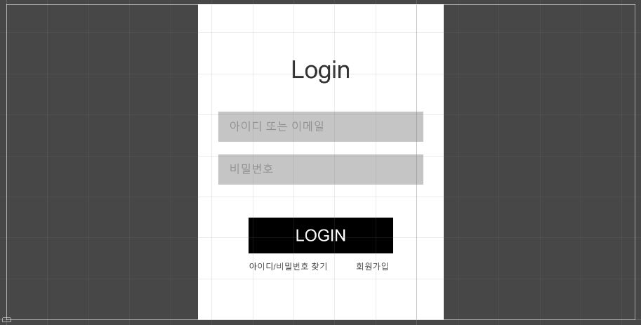
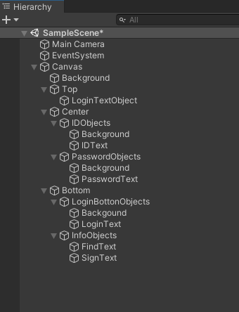

# 실습 1

* 새로운 씬을 하나 만들어서 로그인 화면을 구성하세요

* UI 레이아웃은 어떤 형태든 중요하지 않습니다. 다만 배경, 메인 타이틀(이미지, 텍스트), 아이디 입력란, 비밀번호 입력란, 로그인 버튼은 반드시 포함되어야 합니다.

* UI 리소스는 유니티 내장 리소스를 사용해도 무방합니다. 굳이 새로 만들어서 할 필요는 없으며 외부 리소스를 사용할 시 저작권 문제가 없는 리소스를 사용해주세요

* 이 실습의 목적은 유니티 UI 시스템과 구성요소를 활용하는 부분에 있어 이해를 하고 있는지, 활용이 가능한지가 목적입니다.

* 참고 이미지를 첨부합니다만 똑같이 하라는건 아닙니다.

* 씬을 구성한 과정을 아래에 이전 문서들처럼 설명 부탁드립니다. 남에게 설명할 수 없는 지식은 모르는 지식이라고 생각합니다.

* 예시

|  |
|:--:|
| *https://www.shutterstock.com/ko/image-vector/login-screen-sign-form-template-mobile-1006581937* |

# 실습 1 과정

위의 그림처럼 로그인 화면을 구성하는 방법에 대해서 알아보자.

* 첫 번째로 영역을 잡아주어야한다. 화면을 구성할 때 가장 큰 영역부터 만들어 준다. 로그인 화면 배경(Background) - 상단(Top) - 중앙(Center) - Bottom(하단) 순으로 오브젝트를 생성한다. 오브젝트 생성 후 위치에 맞게 앵커를 잡아준다.

* 상단의 Login 텍스트를 Top 오브젝트 안에 생성한다. 텍스트를 작성 후 폰트, 사이즈, 색상, Best Fit을 설정해준다. 앵커를 조정하여 위치를 맞춰준다.

* Center 오브젝트 안에 아이디 오브젝트를 생성한다. 영역을 잡아준 후 배경 - 텍스트 순으로 오브젝트를 만들어 준다. 비밀번호 오브젝트의 경우 아이디 오브젝트와 텍스트만 다르기 때문에 Window 기준으로 Ctrl + D 단축키를 활용하여 복사해준다. 복사한 오브젝트의 이름과 텍스트를 알맞게 수정해준다.

* Bottom 오브젝트 안에 로그인 버튼을 만들어주기 위해서는 배경 - 텍스트 순으로 생성 후 원하는 크기와 위치를 조정해준다.

* 아이디/비밀번호 찾기, 회원가입 텍스트도 Bottom 오브젝트 안에 생성한다.

