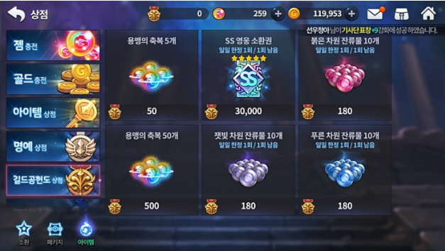

# 실습 1

* 새로운 씬을 하나 만들어서 상점 페이지를 구성하세요

* 2가지의 상점 페이지를 구성해야 합니다. 각각 다른 Canvas로 구성해주세요

1. 전체화면 형태의 세로로 스크롤 되는 상점 UI
2. 팝업 형태의 가로로 스크롤 되는 상점 UI

* UI 레이아웃은 역시 중요하지 않지만 메인 타이틀과, 2개 이상의 상점 카테고리(탭) 및 해당 카테고리에 존재하는 스크롤뷰가 있어야 합니다.

* 모든 작업물은 플레이 했을때 할 수 있는한 최대한으로 동작해야 합니다. 예) : 스크롤뷰는 내부 아이템 갯수만큼 올바르게 스크롤 되어야 합니다. 버튼 오브젝트는 `Button` 컴포넌트가 있어야 합니다.

* UI 리소스는 유니티 내장 리소스를 사용해도 무방합니다. 굳이 새로 만들어서 할 필요는 없으며 외부 리소스를 사용할 시 저작권 문제가 없는 리소스를 사용해주세요

* 이 실습의 목적은 유니티 UI 시스템과 구성요소를 활용하는 부분에 있어 이해를 하고 있는지, 활용이 가능한지가 목적입니다.

* 참고 이미지를 첨부합니다만 똑같이 하라는건 아닙니다.

* 씬을 구성한 과정을 아래에 이전 문서들처럼 설명 부탁드립니다. 남에게 설명할 수 없는 지식은 모르는 지식이라고 생각합니다.

* 예시

|  |
|:--:|
| 상점 1 *https://ggobook-e.tistory.com/21* |

* 예시

|  |
|:--:|
| 상점 2 *http://garmuri.com/game_ui/115277* |