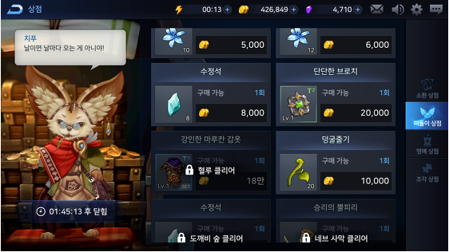
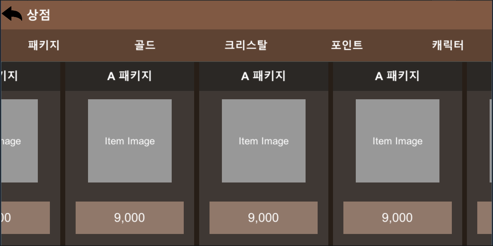
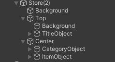
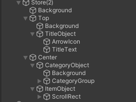
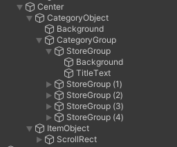
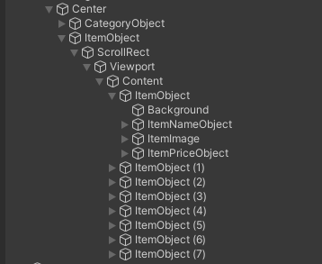

# 실습 1

* 새로운 씬을 하나 만들어서 상점 페이지를 구성하세요

* 2가지의 상점 페이지를 구성해야 합니다. 각각 다른 Canvas로 구성해주세요

1. 전체화면 형태의 세로로 스크롤 되는 상점 UI
2. 팝업 형태의 가로로 스크롤 되는 상점 UI

* UI 레이아웃은 역시 중요하지 않지만 메인 타이틀과, 2개 이상의 상점 카테고리(탭) 및 해당 카테고리에 존재하는 스크롤뷰가 있어야 합니다.

* 모든 작업물은 플레이 했을때 할 수 있는한 최대한으로 동작해야 합니다. 예) : 스크롤뷰는 내부 아이템 갯수만큼 올바르게 스크롤 되어야 합니다. 버튼 오브젝트는 `Button` 컴포넌트가 있어야 합니다.

* UI 리소스는 유니티 내장 리소스를 사용해도 무방합니다. 굳이 새로 만들어서 할 필요는 없으며 외부 리소스를 사용할 시 저작권 문제가 없는 리소스를 사용해주세요

* 이 실습의 목적은 유니티 UI 시스템과 구성요소를 활용하는 부분에 있어 이해를 하고 있는지, 활용이 가능한지가 목적입니다.

* 참고 이미지를 첨부합니다만 똑같이 하라는건 아닙니다.

* 씬을 구성한 과정을 아래에 이전 문서들처럼 설명 부탁드립니다. 남에게 설명할 수 없는 지식은 모르는 지식이라고 생각합니다.

* 예시

|  |
|:--:|
| 상점 1 *https://ggobook-e.tistory.com/21* |

* 예시

|  |
|:--:|
| 상점 2 *http://garmuri.com/game_ui/115277* |

# 실습 과정

## 세로 방향 스크롤 형식의 상점창

* 위와 같이 세로 방향으로 스크롤이 가능한 상점창을 어떻게 제작하는지 알아보자.

* 캔버스를 생성한 뒤 가장 큰 부분인 배경 이미지를 만들어준다. UI 오브젝트 중 Image 오브젝트를 생성한 뒤 이미지를 추가한다.
* 상단, 중앙, 하단 등 UI 리소스가 들어갈 위치에 앵커를 미리 잡아놓으면 편하게 제작이 가능하다. 빈 오브젝트를 생성 후 상단(To) 중앙(Center)으로 이름을 변경 후 위치에 맞게 앵커를 잡아준다.
* 위치에 맞게 해당 오브젝트들을 하위에 생성해준다. 상단(Top)에 먼저 배경 오브젝트를 만든다. 그리고 Title과 뒤로가기 버튼 이미지를 만들기 전 빈 오브젝트 생성 후 그 안에 하위 오브젝트로 구성하여 하나로 묶어주는것이 오브젝트 관리하기에 편리하다.

* 중앙 왼쪽에 위치한 카테고리를 만들기 위해서는 미리 잡아놓은 Center 오브젝트 안에 하위 오브젝트로 CategoryObject를 생성해준다. 이때 오브젝트 이름은 본인이 쉽게 알 수 있는 것으로 만들어준다.
* 배경을 생성해준 후 상점 카테고리가 5개로 구성되어 있기때문에 하나로 묶어주기 위해서 CategoryGroup 오브젝트를 생성한 후 하위에 5개의 카테고리를 만들어준다. 5개의 카테고리를 일정한 간격으로 정렬시키기 위해 CategoryGroup 오브젝트 안에 Add Component - Vertical Layout Group의 순으로 그룹을 만들 수 있는 Component를 추가해준다. 각 오브젝트의 간격을 조정하려면 Spacing으로 조절하면 된다.

* 스크롤 가능한 아이템 창을 만들기 위해서는 ScrollRect - Viewport - Contents 순으로 빈 오브젝트들을 구성해준다. ScrollRect 오브젝트 안에 Scroll Rect 컴포넌트를 추가해준 후 Viewport와 Content 오브젝트를 Scroll Rect 위치에 맞게 드래그하여 추가해준다.
* Contents 오브젝트 하위에 ItemObject를 생성하여 상점 아이템 오브젝트를 만들어준다. 
* 상점 아이템 오브젝트안에 배경 - 아이템 이미지 - 아이템명 - 아이템 가격 순으로 오브젝트를 구성하여 만들어준다.
* 보여주고자 하는 아이템 갯수만큼 ItemObject를 생성한다. 아이템 오브젝트들을 그룹으로 묶어 정렬하기 위해 Contents 오브젝트 안에 Grild Layout Group 컴포넌트를 추가하여 간격을 조정해준다. 그리고 Content Size Fiter 컴포넌트도 추가하여 Content 크기를 알맞게 맞춰준다. Vertical Fit - Preferred Size를 체크하여 준다.
* Viewport에 Mask 컴포넌트를 추가하여 게임창에서 어디까지 보여질지를 설정한다. 이때 Image 컴포넌트도 꼭 추가해준다.

## 가로 방향 스크롤 형식의 상점창

* 세로 방향으로 스크롤이 가능한 상점창을 어떻게 제작하는지 알아보자.

* 캔버스를 생성 후 각 위치에 맞는 빈 오브젝트를 만들어 준다. 가장 먼저 배경 오브젝트(Background)를 만든다. Top 위치에 배경 이미지를 넣어준 후 상점 텍스트와 뒤로가기 아이콘 오브젝트를 순서대로 만들어 준다.

* Center 위치에 카테고리 오브젝트와 아이템 목록 오브젝트를 위치에 맞게 생성해준다. 카테고리 오브젝트 하단에 배경을 먼저 만들어 준다. 카테고리를 나중에 그룹으로 묶어서 정렬을 하면 일정 간격으로 정리가 되기때문에 카테고리 그룹을 지정할 오브젝트를 생성한다.

* 카테고리 그룹 하단에 상점 카테고리를 만들어 준다. 배경과 텍스트 오브젝트를 순서대로 만들어 준 후 Ctrl+D(복사하기) 단축키를 통해 그룹 4개를 생성한다. 복사한 후 안에 내용은 카테고리에 맞게 수정해준다.

* 카테고리 그룹 오브젝트 안에 Add Component - Horizontal Layout Group의 순으로 그룹을 만들 수 있는 Component를 추가해준다. Spacing으로 간격을 조정해준다.

* 아이템 오브젝트 하위에 ScrollRect - Viewport - Content 순으로 오브젝트를 생성한다.

* ScrollRect 오브젝트 안에 Scroll Rect 컴포넌트를 추가해준다. Content와 Viewport 항목에 맞게 오브젝트를 드래그하여 넣어준다.

* Content 오브젝트 하위에 아이템 목록에 들어갈 오브젝트를 생성한다. 순서대로 Background(배경) - ItemNameObject(아이템명) - ItemImage(아이템) - ItemPriceObject(아이템 가격)을 만들어 준다. 아이템 오브젝트를 다 만든 후에는 목록에 들어갈 갯수에 맞게 Ctrl + D(복사) 단축키를 활용하여 오보젝트를 생성한다.

* Content 오브젝트에 Horizontal Layout Group 컴포넌트를 추가하여 가로방향으로 아이템 오브젝트를 정렬시킨다. Spacing을 조정하여 간격을 맞춰준다. Content Size Fitter 컴포넌트도 추가하여 UI 요소의 크기를 조정해준다. Preferred Size(적절한 크기) 항목을 선택해준다.

* Viewport 오브젝트 안에 Mask 컴포넌트를 추가하여 Content의 보여지는 영역을 설정할 수 있다. 이 때 Image 컴포넌트도 추가해줘야한다.
