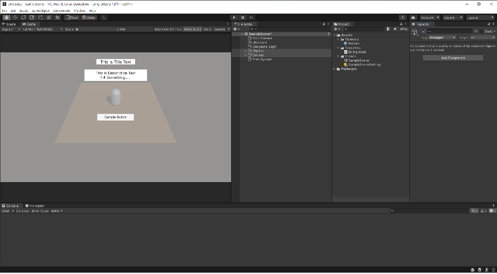

# 유니티 엔진

2D, 3D 게임 개발 환경을 제공하는 게임 엔진이다. 

하지만 3D 애니메이션이나 건축 관련 시뮬레이션, VR 등 과 같은 컨텐츠 제작에도 사용된다.

본 차례는 유니티 엔진을 다루기 앞서 인터페이스를 간단하게 알아보고 각각의 역할에 대해 알아보고자 한다.

## 인터페이스

[Unity Docs - Unity’s interface](https://docs.unity3d.com/kr/current/Manual/LearningtheInterface.html)

|  |
|:--:|
| *유니티* |

|  |
|:--:|
| *커스텀 레이아웃* |

## 사전 용어 정리

* 애셋(Asset) : 프로젝트에서 사용하는 모든 유형의 리소스들을 총칭하는 이름, 프로젝트를 처음 만들면 `Assets` 라는 폴더 하위에 여러 리소스들을 임포트 하게 된다.
* 씬(Scene) : 현재 레벨(화면)에 보여지는 여러 게임 오브젝트가 포함된 애셋, 프로젝트에 따라 여러 개 혹은 한 개만 사용할 수도 있음
* 게임 오브젝트(GameObject) : 프로젝트 창에서 어떤 리소스를 하이어라키로 드래그 하여 실체화 시켰을 때 게임 `게임 오브젝트` 라는 유니티만의 특정한 포맷을 가진 물체가 생성되는데 이를 지칭
* 컴포넌트(Component) : 게임 오브젝트에 동작에 관한 어떤 기능을 지칭, 유니티에서 어떤 물체를 화면에 표현하고 상호작용하기 위한 구조로 `게임 오브젝트`(물체) 와 `컴포넌트`(기능) 을 독립적으로 나누어서 관리와 편집을 용이하게 나눔
* 프리팹(Prefab) : 게임 오브젝트의 설정을 특정한 형태로 저장한 것을 지칭, 프리팹이 된 게임 오브젝트는 씬에 생성 및 재사용이 가능하다. 프리팹 에셋에 대한 모든 편집 사항은 동기화 되므로 반복 작업을 하지 않아도 된다.

## 툴바

툴바를 통해 유니티의 주요 기능에 바로 접근할 수 있다. 

왼쪽의 퀵버튼으로 화면조작, 현재 선택된 오브젝트의 이동, 회전, 크기조절을 바로 수행할 수 있다.

중앙에는 재생, 일시정지, 스탭 컨트롤 을 수행할 수 있다.

오른쪽에는 유니티 계정이나 클라우드에 접근할 수 있으며 레이어와 사용자 커스텀 레이아웃을 저장할 수 있는 메뉴가 있다.

## 하이어라키(Hierarchy)

현재 씬의 모든 오브젝트를 표시해준다.

전체 오브젝트들이 트리 구조로 표현되며 각 오브젝트들은 `부모-자식` 이라는 개념을 통해 상호 연결되어 있다.

게임 오브젝트 그룹을 생성하면 최상단 게임 오브젝트나 씬이 `부모 게임 오브젝트` 가 되고 아래에 있는 모든 게임 오브젝트는 `자식 게임 오브젝트` 가 된다.

## 인스펙터(Inspector)

현재 선택된 오브젝트의 정보를 표시한다.

선택된 오브젝트의 컴포넌트 속성(Property)을 확인하고 편집을 할 수 있다. 

각 컴포넌트 마다 다른 속성과 레이아웃을 가지고 있다.

## 프로젝트(Project)

현재 프로젝트에서 사용할 수 있는 모든 애셋이 표시된다.

작업중인 프로젝트에 어떤 리소스 혹은 애셋(이미지, 스크립트, 오디오)을(를) 사용하고자 할 경우 최우선적으로 프로젝트에 해당 리소스를 임포트 시켜야 한다. 이 때 프로젝트 창에 임포트된 리소스가 표시된다.

## 씬뷰 & 게임뷰(SceneView & GameView)

현재 보여지는 화면을 시각적으로 확인하고 편집할 수 있다.

프로젝트 창에서 하이어라키 창으로 애셋을 드래그해서 현재 씬에 표현하고자 할 경우 씬뷰와 게임뷰 두 화면에 모두 나타난다.

씬뷰의 경우 해당 오브젝트를 시각적으로 확인하여 편집이 가능하고, 배치된 모든 오브젝트들을 확인 할 수 있다.

게임뷰의 경우 설정된 메인 카메라를 기점으로 보여지는 화면을 제공한다.